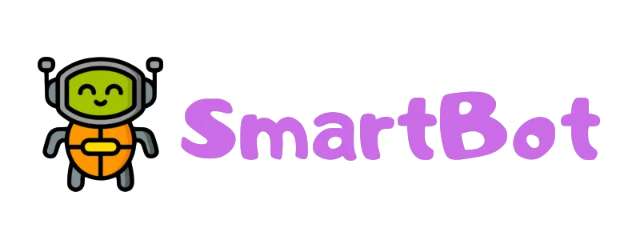

# SmartBot

<p align="center">
  <a href="https://github.com/cleitonleonel/SmartBot">
    
  </a>
</p>

<p align="center">
  <i>Um boilerplate para bots com suporte a modularização e plugins inteligentes.</i>
</p>

<p align="center">
<a href="https://github.com/cleitonleonel/SmartBot">
  
</a>
</p>

---

**Modular SmartBot** é um boilerplate para bots com suporte a modularização e plugins inteligentes, inspirado nos smart plugins do Pyrogram. Ele oferece uma estrutura base para criar bots altamente configuráveis e expansíveis.

## 🚀 Instalação

### Requisitos
- Python 3.9 ou superior
- Poetry (opcional, mas recomendado)

### Instalando com Poetry
1. Clone este repositório:
   ```bash
   git clone https://github.com/cleitonleonel/SmartBot.git
   cd SmartBot
   ```

2. Instale as dependências com Poetry:
   ```bash
   poetry install
   ```

3. Ative o ambiente virtual gerenciado pelo Poetry:
   ```bash
   poetry shell
   ```

### Instalando com pip
1. Clone este repositório:
   ```bash
   git clone https://github.com/cleitonleonel/SmartBot.git
   cd SmartBot
   ```

2. Instale as dependências com pip:
   ```bash
   pip install -r requirements.txt
   ```

## 🛠️ Como Usar

### Configuração Inicial
1. Renomeie o arquivo de exemplo `config_dev.toml` para `config.toml`:
   ```bash
   mv config_dev.toml config.toml
   ```

2. Edite o arquivo `config.toml` com as informações necessárias, como o token do bot e outras configurações.

### Executando o Bot
Com o ambiente configurado, execute o bot com:
```bash
python main.py
```

### Estrutura Modular
Os módulos do bot estão localizados no diretório `handlers`. Cada módulo é carregado automaticamente e segue a estrutura de plugins inteligentes. Você pode criar novos módulos adicionando arquivos Python no diretório `handlers`.

Exemplo de um plugin básico:

```python
import logging
from telethon import events
from smartbot.utils.handler import ClientHandler

logging.basicConfig(level=logging.INFO)

client = ClientHandler()


@client.on(events.NewMessage(pattern='/start'))
async def handle_start(event):
    """
    Handles the `/start` command by sending a greeting message.

    :param event: The event triggered by the `/start` command.
    """
    sender = await event.get_sender()
    sender_id = sender.id
    logging.info(f"Start Handler Triggered by User ID: {sender_id}")
    logging.debug(f"Event Client Instance: {event.client}")

    await event.client.send_message(
        sender_id,
        message=f'Mensagem enviada pelo client: {event.client}',
        buttons=None
    )
    await event.respond(
        message='Resposta enviada por evento.',
        buttons=None
    )
    await event.reply(
        f"Olá, {sender.first_name}! Este é o start handler."
    )
```

## 🧩 Smart Plugins

- Carregue todos os manipuladores de cada módulo, nomeadamente handlers0.py, handlers1.py e handlers2.py em ordem alfabética (arquivos) e ordem de definição (manipuladores dentro de arquivos):

```python
plugins = dict(root="handlers")
```

- Carregue apenas manipuladores definidos dentro de handlers.py e handlers0.py, nesta ordem:

```python
from smartbot.bot import Client

plugins = dict(
    root="handlers", # Diretório raiz dos manipuladores
    include=[
        "subfolder2.handlers2",
        "handlers0"
    ]
)
Client("my_account", plugins=plugins).start_service()
```

- Carregue tudo, exceto os manipuladores dentro de handlers2.py:

```python
from smartbot.bot import Client

plugins = dict(
    root="handlers",
    exclude=["subfolder2.handlers2"]
)
Client("my_account", plugins=plugins).start_service()
```

- Carregue apenas fn3, fn1 e fn2 (nesta ordem) de handlers1.py:

```python
from smartbot.bot import Client

plugins = dict(
    root="handlers",
    include=["subfolder1.handlers1 fn3 fn1 fn2"]
)

Client("my_account", plugins=plugins).start_service()
```

 Adicione o plugin ao diretório `handlers` e ele será carregado automaticamente.

## 🧑‍💻 Contribuindo
Contribuições são bem-vindas! Sinta-se à vontade para abrir issues ou pull requests para melhorar este projeto.

## 📄 Licença
Este projeto está licenciado sob a [MIT License](LICENSE).
